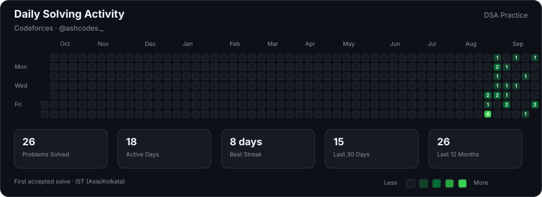
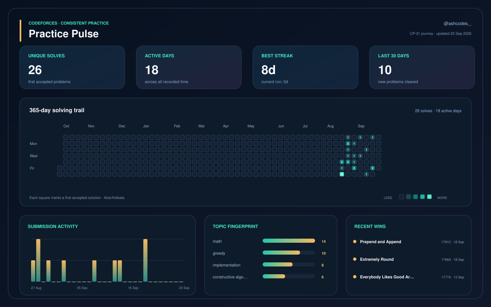

# DSA Practice

A growing collection of my Data Structures and Algorithms practice problems, solved in Python while developing my competitive programming skills through Codeforces and the TLE Eliminators CP-31 Sheet.

[Codeforces Profile](https://codeforces.com/profile/ashcodes._) · [TLE Eliminators CP-31 Sheet](https://www.tle-eliminators.com/cp-sheet)

---

## Journey Snapshot

<!-- AUTO:SNAPSHOT:START -->
| Problems Solved | Practice Level | Language |
|:---:|:---:|:---:|
| **7** | **800** | **Python** |
<!-- AUTO:SNAPSHOT:END -->

---

## Problems

### 800 Level

<!-- AUTO:PROBLEMS:START -->
| Problem | Solution |
|---|:---:|
| Cover in Water — Cover in Water | [Python](800-level/Cover in Water.py) |
| Game with Integers — Game with Integers | [Python](800-level/Game with Integers.py) |
| Halloumi Boxes — Halloumi Boxes | [Python](800-level/Halloumi Boxes.py) |
| Helpful Maths — Helpful Maths | [Python](800-level/Helpful Maths.py) |
| Jagged Swaps — Jagged Swaps | [Python](800-level/Jagged Swaps.py) |
| Line Trip — Line Trip | [Python](800-level/Line Trip.py) |
| Way Too Long — Way Too Long | [Python](800-level/Way Too Long.py) |
<!-- AUTO:PROBLEMS:END -->

---

## Codeforces Activity

Automatically generated from my public Codeforces submissions.

---

## Codeforces Analytics

Automatically generated from Codeforces profile and submission data.

The dashboard tracks:

- Problems solved
- Submission activity
- Solving streaks
- Problem patterns
- Difficulty progression

---

## Progress

This repository documents my competitive programming journey as I solve problems, build consistency, and progress through higher Codeforces difficulty levels.

New solutions, statistics, activity, and analytics are updated automatically.